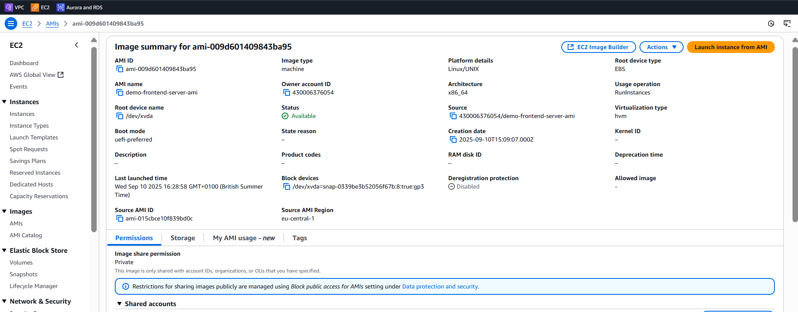

# Three-Tier Application used AWS

This repository contains Frontend, Backend, Database code for build a three-tier architecture. The application demonstrates the fundamental concepts of separating frontend, backend, and database components in a web application.

## Architecture Overview


The application follows the classic three-tier architecture:

1. **Frontend Tier (Presentation Layer)**
   - HTML/CSS/JavaScript
   - Served by NGINX web servers
   - Handles user interface and interactions

2. **Backend Tier (Application Layer)**
   - PHP API
   - Processes business logic
   - Communicates with database
   - Serves data to frontend

3. **Database Tier (Data Layer)**
   - MySQL database
   - Stores application data
   - Provides data persistence

## Features

- Display messages from the database
- Add new messages to the database
- Basic responsive design

## Web Output


## AWS Infrastructure Components

When deployed on AWS, the infrastructure includes:

- **Web ALB**: Load balancer for distributing traffic to web servers
- **NGINX Servers**: EC2 instances in an auto-scaling group
- **App ALB**: Load balancer for distributing traffic to application servers
- **PHP Servers**: EC2 instances in an auto-scaling group
- **RDS MySQL**: Managed relational database service

## Directory Structure

```
three-tier-architecture-aws/
├── frontend/
│   ├── index.html            # Main HTML file
│   ├── styles.css            # CSS styles
│
├── backend/
│   └── api/                  # API endpoints
│       ├── get_messages.php  # API to retrieve messages
│       ├── save_message.php  # API to save new messages
│       └── db_connection.php # Database connection utility
│
├── database/
│   └── database_setup.sql    # SQL schema and initial data
│
└── infrastructure/           # AWS infrastructure configurations
    ├── frontend_server.md     # Frontend server configurations
    ├── backend_server.md     # Backend server configurations
    ├── nginx_config     # Nginx server configurations
```

## Local Setup

### Prerequisites

- Web server with PHP support (XAMPP, WAMP, MAMP, etc.)
- MySQL database

### Steps

1. Create VPC


3. Create subnets
    1. Web Public 1a, 1b, 1c
    2. Web Private 1a, 1b, 1c
    3. App Private 1a, 1b, 1c
    4. Db Private 1a, 1b, 1c


4. Create route tables
    1. Web Public
    2. Web Private 1a, 1b, 1c
    3. App Private 1a, 1b, 1c
    4. Db Private 1a, 1b, 1c


5. Associate route tables with subnet

All other route tables are associated with its relevant subnets.

6. Create internet Gateway (IGW)
    1. Attach it to VPC


7. Create NAT gateway (NATGW) in web public subnet


8. Add IGW and NAT routes in route table
    1. Public -> IGW

    2. Private -> NAT


9. Create security groups
    1. Frontend ALB
    2. Frontend Servers
    3. Backend ALB
    4. Backend Servers
    5. Db Private Servers


10. Create database subnet group


11. Create database server


12. Create Frontend ALB

    1. Create Frontend ALB target group 

13. Create Backend ALB

    1. Create Backend ALB target group

14. Create Frontend Server AMI

    1. Install Nginx
    2. Install Git

15. Create Backend Server AMI

    1. Install PHP, MySQL, Apache
    2. Install Git
    3. Run the database script
'''
-- database_setup.sql  

-- Create database  
CREATE DATABASE IF NOT EXISTS hello_world;  
USE hello_world;  

-- Create messages table  
CREATE TABLE IF NOT EXISTS messages (  
    id INT AUTO_INCREMENT PRIMARY KEY,  
    message VARCHAR(255) NOT NULL,  
    created_at TIMESTAMP DEFAULT CURRENT_TIMESTAMP  
);  

-- Insert some initial data  
INSERT INTO messages (message) VALUES   
('Hello from the database!'),  
('Welcome to our three-tier architecture demo'),  
('This is a simple example showing frontend, backend, and database');  
'''

15. Create the Launch Template for Frontend Server
16. Create the Launch Template for Backend Server


17. Create the Auto Scaling Group for Frontend Server
18. Create the Auto Scaling Group for Backend Server


## Development

### Frontend Development

The frontend is built with plain HTML, CSS, and JavaScript. It uses the Fetch API to communicate with the backend.

To make changes to the frontend:
1. Modify the HTML/CSS/JavaScript files in the `frontend` directory
2. Test the changes locally

### Backend Development

The PHP backend provides simple API endpoints for retrieving and saving messages.

To make changes to the backend:
1. Modify the PHP files in the `backend/api` directory
2. Test the changes locally

## Security Considerations

This is a demo application and lacks several security features that would be necessary in a production environment:

- Input validation and sanitization
- Authentication and authorization
- HTTPS encryption
- Protection against SQL injection (although PDO with prepared statements is used)
- CORS configuration

## License

This project is released under the MIT License.

## Acknowledgements

This sample application was created as a demonstration of AWS three-tier architecture principles.


